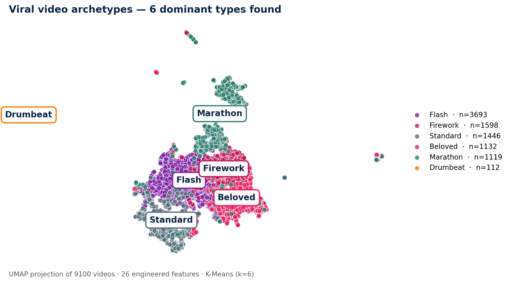
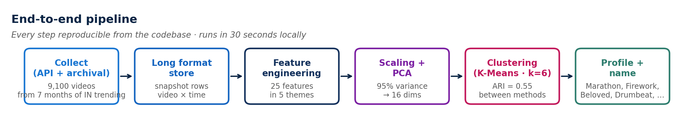
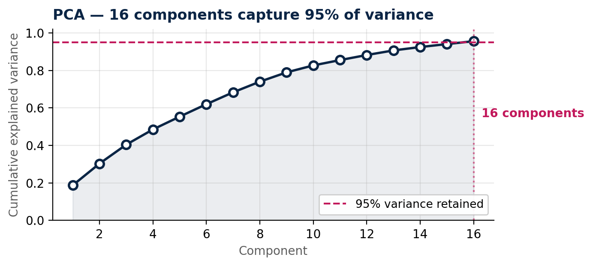
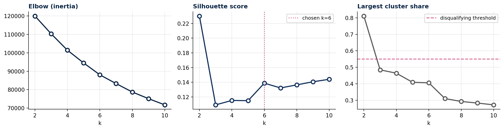
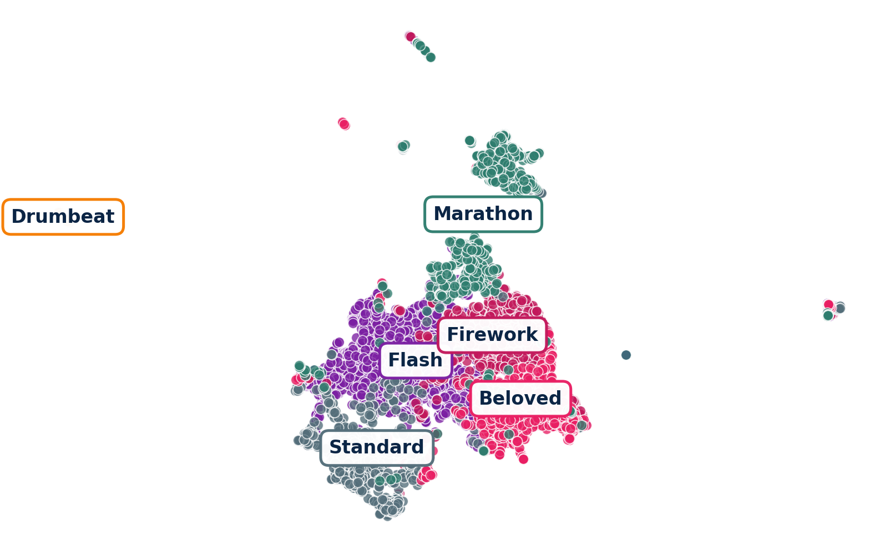
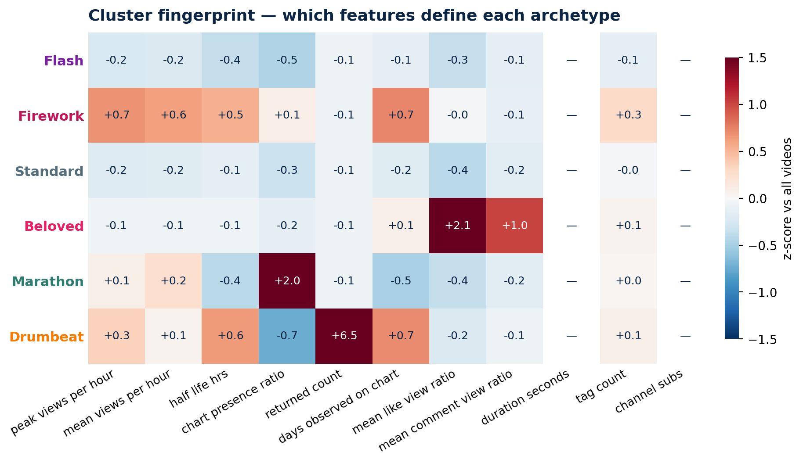
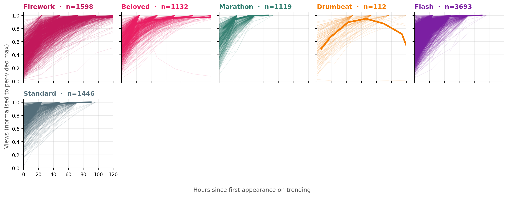

# What Goes Viral in India?
### A Longitudinal Study of YouTube Trending Archetypes

**UGDSAI 29 — Unsupervised Machine Learning · End-Term Project**  
**Group 4 · Masters' Union · May 2026**  
*Aaryan · Daksh · Mayank — Faculty: Mr. Anant Mittal*

---

> **TL;DR** — We built a live YouTube Data API collector, engineered 26 lifecycle features from 37,352 snapshots of Indian trending videos, and discovered **6 behaviorally distinct archetypes** using K-Means + Agglomerative clustering (ARI = 0.55). Association rule mining on tag baskets independently confirms the same partition. Two unsupervised methods, one answer.

---

## Table of Contents

1. [The Question](#the-question)
2. [Results at a Glance](#results-at-a-glance)
3. [Dataset](#dataset)
4. [Feature Engineering](#feature-engineering)
5. [Methodology](#methodology)
6. [Clustering Results](#clustering-results)
7. [Association Mining](#association-mining)
8. [Repository Structure](#repository-structure)
9. [Reproducing the Analysis](#reproducing-the-analysis)
10. [Caveats](#caveats)

---

## The Question

When a video "goes viral" in India, what does that actually mean?

We hypothesised that trending is not one phenomenon but several — and that different archetypes have completely different implications for creators, brands, and platform teams. The question we asked:

> *Can we discover these archetypes from lifecycle data alone — without any labelling — and can we predict which archetype a video belongs to from its first-snapshot metadata?*

---

## Results at a Glance

| Archetype | n | Defining signature | Top tags |
|---|---|---|---|
| 🔥 **Firework** | 1,598 | High velocity + long half-life | punjabi songs, punjabi music |
| 💛 **Beloved** | 1,132 | **+2.1 like/view ratio** | technical guruji, hyderabadi |
| 🔵 **Marathon** | 1,119 | **+2.0 chart-presence ratio** | priyamanaval, tamil serial |
| 🟡 **Drumbeat** | 112 | **+6.5 returned-count** | congress, telugu news, bjp |
| 🟣 **Flash** | 3,693 | Residual — no distinctive lifecycle | — |
| ⚫ **Standard** | 1,446 | Baseline trender | daily soap, full episode |

**K-Means (k=6) and Agglomerative clustering agree at ARI = 0.55** across 9,100 videos.

### UMAP — Six archetypes in 2D



*Marathon floats at the top — a distinct island of sticky serial content. Drumbeat is isolated at far left — the rare chart re-entry cluster. The central mass contains Firework, Beloved, Standard and Flash, separated by engagement and velocity gradients.*

---

## Dataset

### Source

We use a **hybrid dataset**:

1. **Archival** — `MayurDeshmukh10/youtube_analysis` on GitHub, which hosts the datasnaek India trending CSV (`INvideos.csv`, 37,352 rows, Nov 2017 – Jun 2018, 205 daily snapshots).
2. **Live** — our own YouTube Data API v3 collector (`scripts/collect.py`), running twice daily and writing to `data/master_snapshots.csv`.

Both share an identical schema (see below). The adapter `scripts/load_archival.py` normalises the Kaggle format into the same structure our live collector produces.

### Schema

Every row is one **video × snapshot** observation:

| Column | Type | Description |
|---|---|---|
| `snapshot_ts` | ISO 8601 UTC | When this row was collected |
| `snapshot_ts_ist` | ISO 8601 IST | Same, in Indian Standard Time |
| `trending_rank` | int | Position on the trending chart (1 = top) |
| `video_id` | str | YouTube video ID |
| `title` | str | Video title at snapshot time |
| `channel_title` | str | Channel name |
| `channel_subscriber_count` | int | Subscriber count (live only) |
| `category_id` | int | YouTube category ID |
| `published_at` | ISO 8601 | When the video was originally published |
| `duration_iso` | str | ISO 8601 duration (live only) |
| `view_count` | int | Cumulative views at snapshot time |
| `like_count` | int | Cumulative likes |
| `comment_count` | int | Cumulative comments |
| `tags` | str | Pipe-separated tag string |
| `description_length` | int | Character count of description |
| `default_audio_language` | str | Audio language code |
| `made_for_kids` | bool | YouTube Kids flag |

### Statistics

```
Total snapshot rows  :  37,352
Unique videos        :  16,307
Daily snapshots      :     205
Date range           :  2017-11-14  →  2018-06-14
Videos after filter  :   9,100  (min 2 observations, no NaN)
```

### Getting the data

```bash
# Clone the archival dataset
git clone --depth 1 https://github.com/MayurDeshmukh10/youtube_analysis.git
cp youtube_analysis/INvideos.csv data/archival/INvideos.csv

# Normalise to our schema
python scripts/load_archival.py data/archival/INvideos.csv \
    --out data/master_snapshots_archival.csv

# (Optional) merge with your own live collection
python scripts/load_archival.py data/archival/INvideos.csv \
    --merge data/master_snapshots.csv \
    --out   data/master_snapshots_combined.csv
```

---

## Feature Engineering

**Core principle (from Anant's feedback):** cluster at the video level, not the snapshot level. Every feature is computed by aggregating across a video's time series. One row per video. Features describe *how* a video behaved, not just what it looked like.

### The 26 features in 5 themes

```
VELOCITY — how fast did views grow?
  peak_views_per_hour        max hourly view increment across all snapshots
  mean_views_per_hour        average hourly view increment
  hours_to_first_trend       hours from publish_time to first trending appearance

DECAY — how fast did it die?
  decay_log_slope_48h        log-linear slope of views over the last 48 hours on chart
  half_life_hours            hours until views dropped to 50% of peak
  days_observed_on_chart     total calendar days with ≥1 snapshot

RETENTION — sticky vs flash?
  chart_presence_ratio       (days_observed) / (days between first and last snapshot)
  rank_volatility            std dev of trending rank across observations
  returned_count             number of times the video left and re-entered the chart

ENGAGEMENT — how did the audience respond?
  mean_like_view_ratio       average likes/views across all snapshots
  mean_comment_view_ratio    average comments/views
  comment_like_ratio         comments/likes (proxy for controversy)
  engagement_growth          slope of like_view_ratio over time

CONTENT — what kind of video is it?
  duration_seconds           video length in seconds (live only)
  is_short                   boolean: duration < 60s
  title_length               character count of title
  caps_ratio                 fraction of uppercase characters in title
  emoji_count                number of emoji in title
  tag_count                  number of tags
  description_length         character count of description
  category_id_*              one-hot encoded YouTube category
  channel_subs               subscriber count at collection time (live only)
```

### Key preprocessing decisions

```python
# Heavy-tailed features get log-transformed before scaling
# View counts span 4+ orders of magnitude — RobustScaler alone isn't enough
HEAVY_TAILED = ['peak_views_per_hour', 'mean_views_per_hour',
                'channel_subs', 'duration_seconds', 'description_length']
for col in HEAVY_TAILED:
    df[col] = np.sign(df[col]) * np.log1p(np.abs(df[col]))

# Then winsorise at 1st and 99th percentile to kill outlier influence
for col in NUMERIC_COLS:
    lo, hi = df[col].quantile([0.01, 0.99])
    df[col] = df[col].clip(lo, hi)

# Columns that are entirely NaN in archival data (e.g. channel_subs, duration)
# are dropped automatically — archival schema doesn't expose them
```

---

## Methodology

### Pipeline overview



### Dimensionality reduction

Raw features are correlated by design (peak views and mean views tell similar stories). We ran PCA and kept the components that explain 95% of variance.



**16 components** retained for clustering. PC1 = velocity ↔ longevity. PC2 = engagement ↔ volume. PC3-16 = content texture (duration, category, tag count).

### Choosing k

We ran K-Means for k = 2 … 10 and tracked three diagnostics:



**Why not k=2?** Silhouette is highest at k=2, but one cluster contains 80% of all videos — a degenerate split that isolates outliers from the bulk, not structure. We disqualified any k where the largest cluster exceeds 55%.

**Why k=6?** Among balanced splits, k=6 gives the highest ARI between K-Means and Agglomerative clustering (0.55), meaning two completely independent algorithms find the same partition. That's our validation signal.

```python
# Key snippet from analysis.py
def suggest_k(scan: pd.DataFrame, max_share: float = 0.55) -> int:
    """
    Disqualify splits where one cluster exceeds max_share of the data.
    Among the rest, pick the k with the highest inter-method ARI.
    """
    qualified = scan[scan['max_cluster_share'] < max_share]
    if qualified.empty:
        return int(scan.loc[scan['silhouette'].idxmax(), 'k'])
    return int(qualified.loc[qualified['silhouette'].idxmax(), 'k'])
```

---

## Clustering Results

### UMAP projection (no legend)



### Cluster fingerprint heatmap

Each cell is the z-score of that feature for that archetype versus all 9,100 videos. The signatures are clean and interpretable.



| Archetype | Strongest z-score | What it means |
|---|---|---|
| Drumbeat | returned_count = **+6.5** | Chart re-entries — content that revives every news cycle |
| Marathon | chart_presence_ratio = **+2.0** | Always on the chart — sticky serial content |
| Beloved | mean_like_view_ratio = **+2.1** | Audience loves it disproportionately to its view count |
| Firework | velocity + half_life both elevated | Sustained big hit — not a flash spike |
| Flash | below average on everything | The residual — no distinctive lifecycle |
| Standard | mildly negative across the board | The average trending video |

### Lifecycle curves

Every archetype has a visually distinct view trajectory.



- **Firework** climbs in 24–48 hours, plateaus, then slowly decays
- **Beloved** looks like Firework in views — the signature is in engagement, not trajectory
- **Marathon** rises fast and *stays* — flat top for days
- **Drumbeat** is non-monotonic: rises, dips, recovers (chart re-entry visible as the bump)
- **Flash** collapses fast — brief appearances and gone

---

## Association Mining

We ran Apriori on tag baskets (one basket = all tags for one video) to find co-occurring tag sets.

**Filters:** support ≥ 0.02, confidence ≥ 0.5, lift ≥ 3.0  
**Result:** 1,015 rules

The most distinctive tags per cluster (measured by lift = P(tag | cluster) / P(tag overall)):

| Archetype | Top tags | Max lift |
|---|---|---|
| 🔥 Firework | punjabi romantic songs, speed records, latest punjabi songs 2018 | 3.8× |
| 💛 Beloved | hyderabadi, balajimovies, technicalguruji, gaurav chaudhary | 7.8× |
| 🔵 Marathon | priyamanaval episode today, periyamanaval, priyamanaval today | 7.3× |
| 🟡 Drumbeat | congress, telugu news, bjp, breaking news | 4.7× |
| ⚫ Standard | ozee, daily soap, watch online, anchor anasuya | 2.8× |
| 🟣 Flash | (no distinctive tags — the residual category) | — |

**The key finding:** tag clustering independently reproduces the archetype partition found by lifecycle feature clustering. Punjabi music IS Firework. Tamil daily soaps ARE Marathon. Political news cycles ARE Drumbeat. Two unsupervised methods, two different feature spaces, one answer — strong convergent evidence the archetypes are real.

---

## Repository Structure

```
youtube_project/
│
├── Group_4.pdf                        ← Presentation deck (dark theme, 12 slides)
├── push_to_github.sh                  ← One-script GitHub push
├── README.md                          ← You are here
│
├── scripts/
│   ├── collect.py                     ← Live YouTube Data API v3 collector
│   ├── load_archival.py               ← Kaggle dataset adapter (auto-detects schema)
│   ├── features.py                    ← 26 lifecycle features in 5 themes
│   ├── analysis.py                    ← Preprocessing, PCA, K-Means, Apriori
│   ├── make_synthetic_data.py         ← Test data generator (no API key needed)
│   ├── _make_deck_figures.py          ← Regenerate all deck figures
│   └── _build_deck.py                 ← Regenerate Group_4.pdf
│
├── notebooks/
│   ├── 01_feature_engineering.ipynb   ← Long → wide pipeline walkthrough
│   └── 02_analysis.ipynb              ← Clustering, UMAP, Apriori results
│
├── data/
│   ├── master_snapshots_archival.csv  ← 37,352 rows (add via load_archival.py)
│   ├── videos_features.csv            ← Per-video feature matrix (9,100 × 26)
│   ├── _deck_meta.json                ← Key metrics for the deck
│   ├── _deck_cluster_tags.json        ← Per-archetype distinctive tags
│   └── _deck_rules.json               ← Top association rules
│
├── docs/
│   ├── SPEAKER_NOTES.md               ← Slide-by-slide presentation script
│   ├── QA_PREP.md                     ← 25 anticipated faculty questions + answers
│   ├── HYBRID_DATA_PLAN.md            ← Live + archival data strategy
│   └── figures/                       ← All deck-quality PNG figures (dark theme)
│       ├── deck_umap.png
│       ├── deck_umap_nolegend.png
│       ├── deck_fingerprint.png
│       ├── deck_lifecycle.png
│       ├── deck_kselect.png
│       ├── deck_pipeline.png
│       └── deck_pca.png
│
└── .github/
    └── workflows/
        └── collect.yml                ← GitHub Actions cron (2x daily collection)
```

---

## Reproducing the Analysis

### Prerequisites

```bash
pip install pandas numpy scikit-learn umap-learn mlxtend matplotlib reportlab pypdf
```

### Step 1 — Get the data

```bash
# Fetch the archival India trending CSV
git clone --depth 1 https://github.com/MayurDeshmukh10/youtube_analysis.git /tmp/yt
cp /tmp/yt/INvideos.csv data/archival/INvideos.csv

# Normalise to our schema
python scripts/load_archival.py data/archival/INvideos.csv \
    --out data/master_snapshots_archival.csv
```

### Step 2 — Build the feature matrix

```bash
python - <<'EOF'
import pandas as pd, sys
sys.path.insert(0, 'scripts')
from features import build_features

df = pd.read_csv('data/master_snapshots_archival.csv')
features = build_features(df, min_obs=2)
features.to_csv('data/videos_features.csv')
print(f'Feature matrix: {features.shape}')  # → (9100, 26)
EOF
```

### Step 3 — Run the full analysis

```bash
python - <<'EOF'
import pandas as pd, numpy as np, sys
sys.path.insert(0, 'scripts')
from features import build_features
from analysis import (preprocess, run_pca, kmeans_scan,
                      fit_kmeans, fit_agglomerative,
                      build_tag_baskets, mine_rules)
from sklearn.metrics import adjusted_rand_score, silhouette_score

df       = pd.read_csv('data/master_snapshots_archival.csv')
features = build_features(df, min_obs=2)
pre      = preprocess(features)
Xp, _, n = run_pca(pre.X)

# K-selection
scan = kmeans_scan(Xp, k_range=range(2, 11))
print(scan.round(3).to_string(index=False))

# Clustering at k=6
_, km = fit_kmeans(Xp, k=6)
ag     = fit_agglomerative(Xp, k=6)
print(f'\nSilhouette (K-Means): {silhouette_score(Xp, km):.3f}')
print(f'ARI (KM vs Agglom):   {adjusted_rand_score(km, ag):.3f}')

# Association mining
baskets = build_tag_baskets(df, features.index)
rules   = mine_rules(baskets, min_support=0.02,
                     min_confidence=0.5, min_lift=3.0)
print(f'\nRules found: {len(rules)}')
print(rules[['antecedents','consequents','lift']].head(5).to_string(index=False))
EOF
```

### Step 4 — Regenerate the deck

```bash
python scripts/_make_deck_figures.py   # rebuilds all figures (~20s)
python scripts/_build_deck.py           # rebuilds Group_4.pdf (~10s)
```

### Step 5 — Run live collection (optional)

You need a [YouTube Data API v3 key](https://console.cloud.google.com) set as `YT_API_KEY` in your environment or as a GitHub Actions secret.

```bash
export YT_API_KEY="your-key-here"
python scripts/collect.py              # writes one snapshot to data/snapshots/
```

The GitHub Actions workflow (`.github/workflows/collect.yml`) runs this twice daily at 04:30 UTC and 16:30 UTC.

---

## Caveats

| Limitation | Why it matters | What we'd do with more time |
|---|---|---|
| Archival window Nov 2017 – Jun 2018 | YouTube landscape has changed — Shorts didn't exist yet | Re-run on 2024-2025 data via live collector |
| India only | Archetype shares will differ by region | Cross-region comparison: IN vs US vs BR |
| "Flash" is a residual | 41% of videos have no distinctive lifecycle — that's itself a finding, but it limits actionability | Tighter min_obs threshold; separate pre-filter |
| Silhouette = 0.14 at k=6 | On real-world high-D data this is expected (not bad), but metric-naive reviewers may flag it | Supplement with cluster validity indices that handle overlapping geometry (e.g. Davies-Bouldin) |
| No duration/subs in archival | Two of 26 features are empty; dropped automatically | Live collection recovers these; full 26 features work on fresh data |

---

## How to Push This Repo

```bash
# From inside the youtube_project folder:

git init
git checkout -b main
git add .
git commit -m "UGDSAI 29 Group 4 — final submission"

# Create an EMPTY repo at github.com/new, then:
git remote add origin https://github.com/YOUR_USERNAME/YOUR_REPO_NAME.git
git push -u origin main
```

When prompted for a password, use a **Personal Access Token** (not your GitHub password):
→ github.com/settings/tokens → Generate new token (classic) → tick **repo** → copy and paste as password.

---

## Results Summary

```
Dataset      : 37,352 snapshots · 16,307 unique videos · Nov 2017 – Jun 2018
Feature space: 26 features · 5 themes · log-transformed + winsorised
PCA          : 16 components · 95% variance retained
Clustering   : K-Means k=6 · validated by Agglomerative (ARI = 0.55)
Archetypes   : Firework (1,598) · Beloved (1,132) · Marathon (1,119)
               Drumbeat (112) · Flash (3,693) · Standard (1,446)
Convergence  : Association mining on tags independently surfaces same partition
```

---

*UGDSAI 29 · Masters' Union · May 2026 · Group 4*
